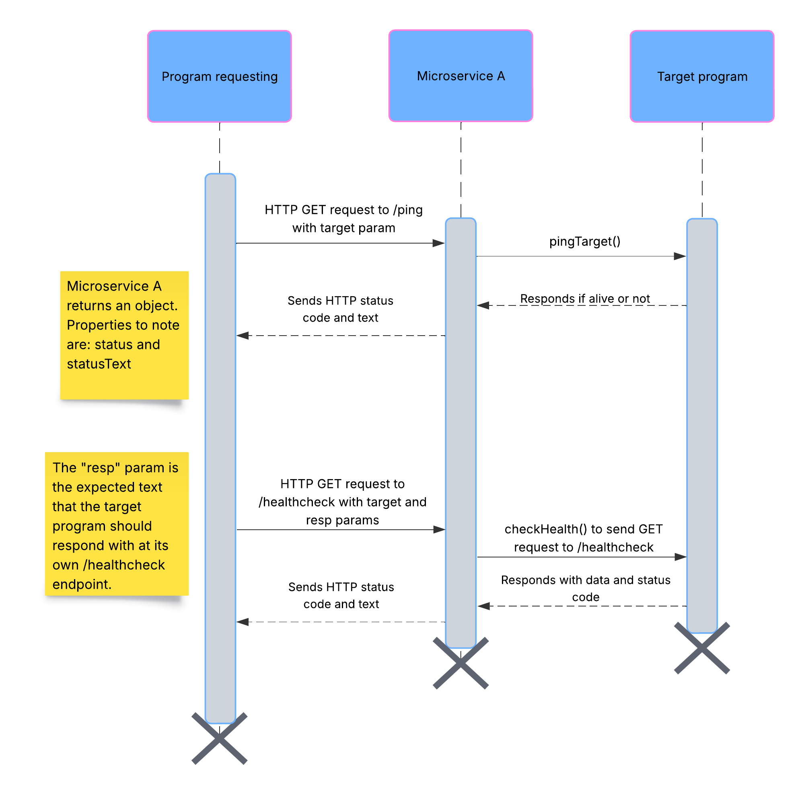

# Communication Contract

## A. Requesting data
Requests to the microservice should be made through HTTP requests.

### Pinging
For pinging a target IP, a GET request should be made to the endpoint: `/ping?target=TARGET_IP`.

#### Example pinging using JavaScript
```javascript
await fetch(`${MICROSERVICE_A_URL}/ping?target=${TARGET_IP}`, { method: "GET" });
```

### Healthcheck
For a healthcheck, a GET request should be made to the endpoint: `/healthcheck?target=TARGET_IP&resp=EXPECTED_RESPONSE`.

#### Example healthcheck using JavaScript
```javascript
await fetch(`${MICROSERVICE_A_URL}/healthcheck?target=${TARGET_IP}&resp=${EXPECTED_RESPONSE}`, {
  method: "GET",
});
```

## B. Receiving data
The microservice responds back with the HTTP status code and status text.

#### Example with pinging in JavaScript
```javascript
async function ping() {
  try {
    const response = await fetch(`${MICROSERVICE_A_URL}/ping?target=${TARGET_IP}`, { method: "GET" });
    console.log(response.status); // { status: 200, statusText: "OK" } or { status: 503, statusText: "Service Unavailable" }
  } catch (error) {
    console.error(error);
  }
}
```

#### Example with healthcheck in JavaScript
```javascript
async function checkHealth() {
  try {
    const response = await fetch(`${MICROSERVICE_A_URL}/healthcheck?target=${TARGET_IP}&resp=${EXPECTED_RESPONSE}`, {
      method: "GET",
    });
    console.log(response.status); // { status: 200, statusText: "OK" } or { status: 503, statusText: "Service Unavailable" }
  } catch (error) {
    console.error(error);
  }
}
```

## C. UML sequence diagram
